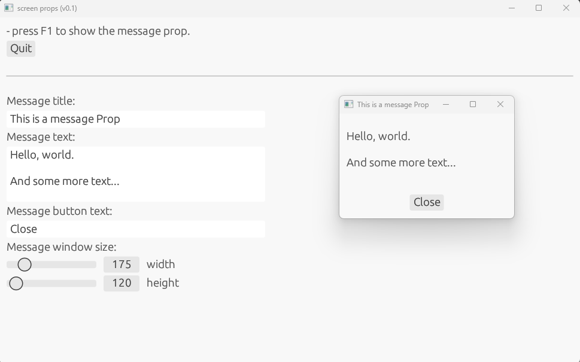

# screen_props

Utilities to show messages, dialogs, images,... on a screen. In order to film scenes where those resources are required on any screen present on a filming set.

To use:
- Start the program. 
- Configure the props you want to use with the text/colors/options/... you want to show. 
- Remember the launching keys for each prop. 
- Grab the program's window from the title bar and drag it to a corner of the screen, in order to hide most part of it. (You cannot minimize the main window. The program must have focus in order to capture key press events.)
- Try and see how each prop appears as you type each launching key.

Tips:
- You can configure the props while they are open. Configuring interatively is easier to get it right.
- When filming, you can have two USB keyboards connected to the same computer: one visible on the scene and anoter hidden to launch the props. 

# Available props

## Message

# Pending props (in development)

## Scrolling log

