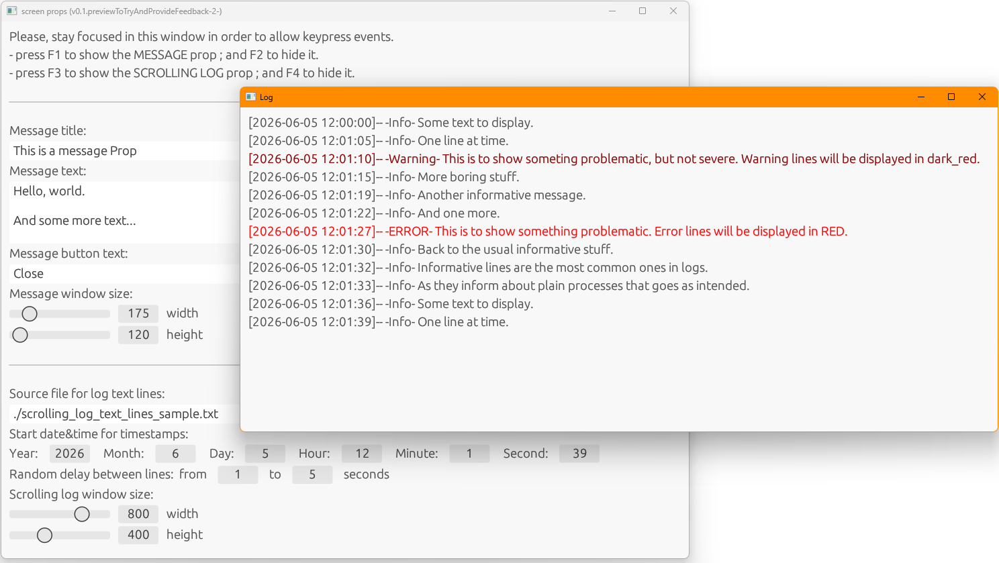

# screen_props

Utilities to show messages, dialogues, images,... on a screen. In order to film scenes where those resources are required on any screen present on a filming set.

To use:
- Start the program. 
- Configure the props you want to use with the text/colors/sizes/options/etc you want to show. 
- Remember the launching keys for each prop. 
- Grab the program's window from the title bar and drag it to a corner of the screen, in order to hide most part of it. Or drag the program's window to another screen that will not appear on the scene.
  > You cannot minimize the main window. Nor put the cursor on another window. The program must have focus in order to capture key press events.
- Try and see how each prop appears as you type each launching key.

Tips:
- You can configure the props while they are open. Configuring interatively is easier to get them right.
- When filming, you can have two USB keyboards connected to the same computer: one visible on the scene and another keyboard hidden to manage/launch the props. You can also have several screens; some visible on the scene and another screen hidden to manage/launch the props. 

# Available props

## Message

to show a sudden message/warning/error/...

## Scrolling log

to show a bunch of log lines appearing on the screen

# Pending props (in development)

## De-blurring image

to show a image being processed/cleared by a forensic tool

## Zooming image

to show a forensic tool focusing/zooming a little detail on a broader image

## Security cameras

to show several videos simulating security camera feeds